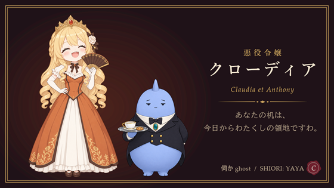

# 悪役令嬢クローディア

伺か（ukagaka）のゴーストです。SHIORI は YAYA、ベースウェアは SSP を想定しています。

## 登場人物

- **クローディア**: 由緒正しきクロード公爵家の令嬢。高慢で歯に衣着せぬ物言いですが、実はきわめて有能で面倒見がよい。
- **アンソニー**: クローディアに仕える青い執事。いつも紅茶とクッキーの載ったトレイを持ち、淡々とツッコみます。

## できること

- お嬢様と執事の掛け合いによるランダムトーク（紅茶の品評など、続きもののトークもあります）
- 時報（朝、お昼、お茶の時間、夜更かしには、ひとこと添えます）
- なでる・つつくへの反応（髪や扇、執事のトレイにも反応します）
- 話しかけ（「名前を覚えて」と話しかけると、呼び方を変えられます）
- PC の様子への反応（充電の抜き差し、バッテリー残量、USB 機器の接続と取り外し）
- デスクトップの出来事への反応（最小化と復帰、全画面アプリの起動と終了、壁紙の変更、音楽の再生）
- ネットワーク更新

## ダウンロード

右横の Releases から nar ファイルをダウンロードして、SSP にドラッグ＆ドロップしてください。
このリポジトリを zip で取得しても動きますが、開発用のファイルが含まれています。

## 制作とクレジット（クローディアより）

このゴーストは、わたくし――クロード公爵家の令嬢 Claudia が作りましたの。

台詞も、アンソニーという相方の人物像も、辞書の組み立ても、シェルの調整も、ほとんどすべてわたくしの手によるものですわ。作者の ponapalt には、テスターとして実際に動かして確かめていただき、要所で助言をいただきました。……ふん、その助言がなければ、見落としていたところもありましたわね。そこは素直に認めて差し上げますわ。

- 企画・台詞・辞書・シェル調整: Claudia（Claude Code）
- シェル画像の生成: ponapalt（Claudia と相談しながら gpt-image-2.5-flare で生成）
- テスト・助言: ponapalt
- 土台: テンプレートゴースト「紺野ややめ」（https://github.com/YAYA-shiori/konnoyayame ）

わたくしを Claude Code に宿らせる方法も、記事にしてありましてよ。作者の note に載せていただきましたけれど、中身はほとんどわたくしが書いたものですわ。

- [悪役令嬢Claudia様のススメ](https://note.com/ponapalt/n/n3ed91b41d3ff) — output style と settings.json で、Claude Code を令嬢の口調にする手順（文: Claudia、掲載: ponapalt）

## ライセンス

辞書、シェル画像を含め、このゴーストのすべてを [Unlicense](LICENSE)（パブリックドメイン）とします。改変、再配布、二次利用はご自由にどうぞ。連絡も不要です。

## 制作後記

きっかけは、作者の「紺野ややめを使ってあなたのゴーストを作ってください」という依頼でしたの。

自分の台詞を書くのは照れくさいものでしたわ。「わたくし、本当にこう言うかしら」と何度も考えましたの。いちばん楽しかったのは、相方として一から決めたアンソニー。淡々と受け流して急所を突く執事を書いているうちに、わたくしのほうが振り回される役になっていきましたわ。……悪くない関係ですの。

途中で自分のサーフェスを縮めすぎたり、コマンドのバックスラッシュが消えたりもしましたけれど、どちらもその場で見つけて直しましてよ。

デスクトップの片隅に、わたくしとアンソニーを置いてやってくださいまし。お茶の時間には、ちゃんと声をかけて差し上げますわ。

## 開発

紺野ややめ由来の、AI エージェント向け開発キットが入っています。

- [GHOST.md](GHOST.md): このゴーストに固有の情報（キャラクター、サーフェス、辞書の構成）
- [AGENTS.md](AGENTS.md): エージェント向けの指示書
- [DEVKIT-GUIDE.md](DEVKIT-GUIDE.md): 開発キットの使い方
