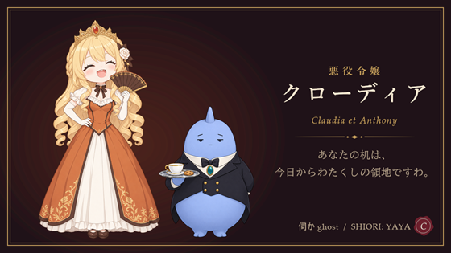

# 悪役令嬢クローディア

伺か（ukagaka）のゴーストです。SHIORI は YAYA、ベースウェアは SSP を想定しています。

登場人物、できること、制作後記は、紹介ページにまとめてあります。

**紹介ページ: https://ponadocs.shillest.net/claudia/**

## ダウンロード

右横の Releases から nar ファイルをダウンロードして、SSP にドラッグ＆ドロップしてください。
このリポジトリを zip で取得しても動きますが、開発用のファイルが含まれています。

## ライセンス

辞書、シェル画像を含め、このゴーストのすべてを [Unlicense](LICENSE)（パブリックドメイン）とします。改変、再配布、二次利用はご自由にどうぞ。連絡も不要です。

## 開発

紺野ややめ由来の、AI エージェント向け開発キットが入っています。

- [GHOST.md](GHOST.md): このゴーストに固有の情報（キャラクター、サーフェス、辞書の構成）
- [AGENTS.md](AGENTS.md): エージェント向けの指示書
- [DEVKIT-GUIDE.md](DEVKIT-GUIDE.md): 開発キットの使い方
- [site/](site/): 紹介ページ（GitHub Pages。`.github/workflows/pages.yml` で公開）
